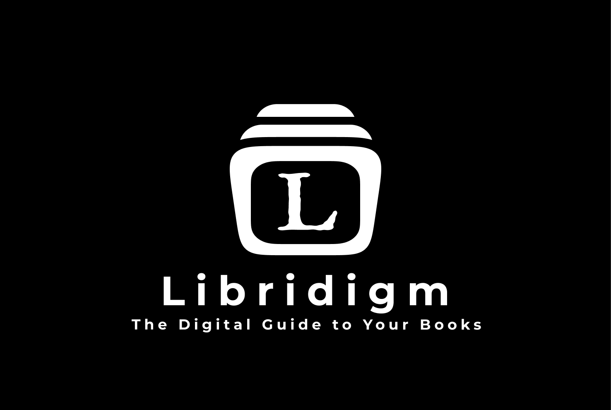
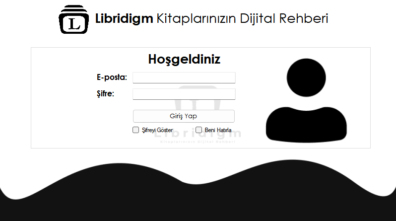
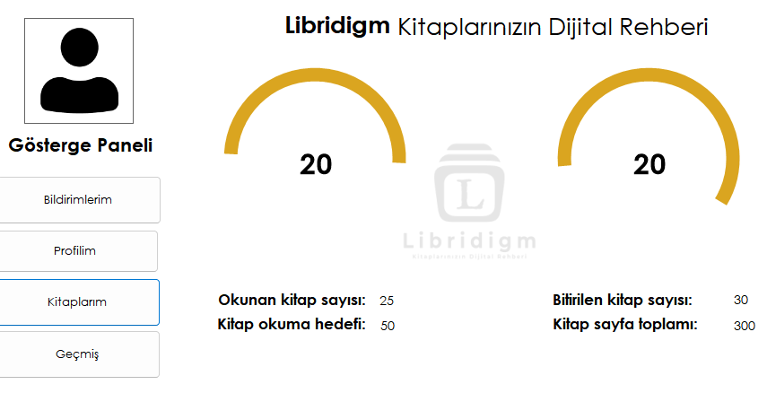
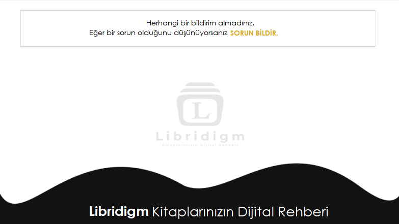
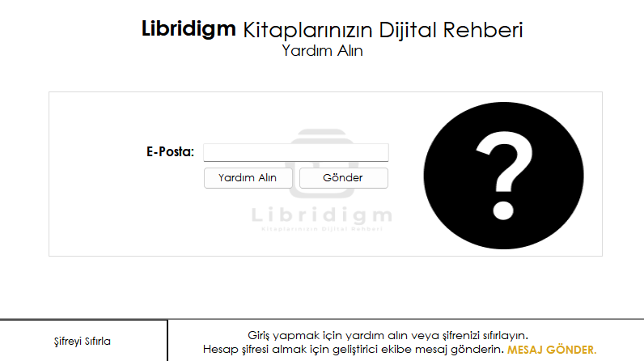
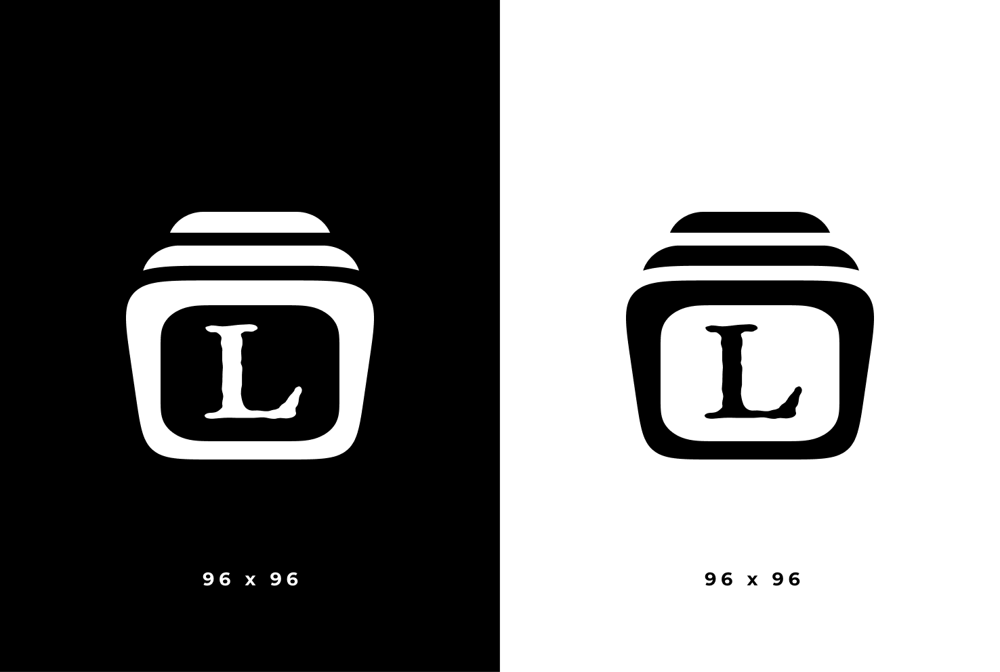
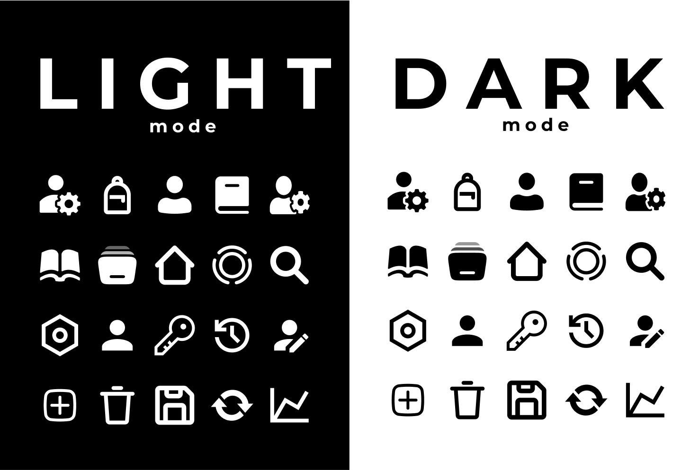
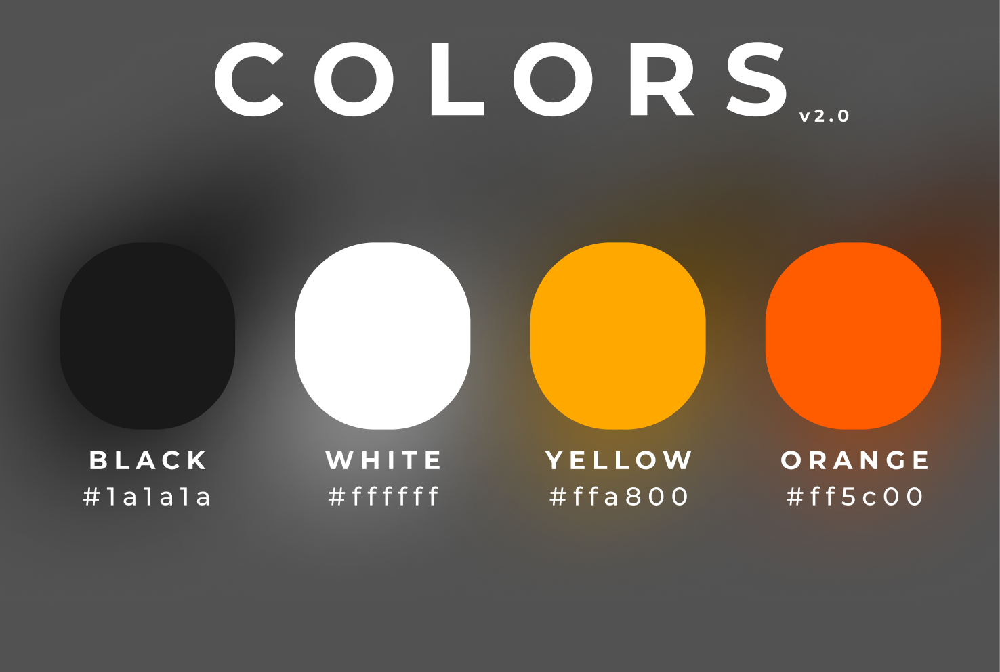
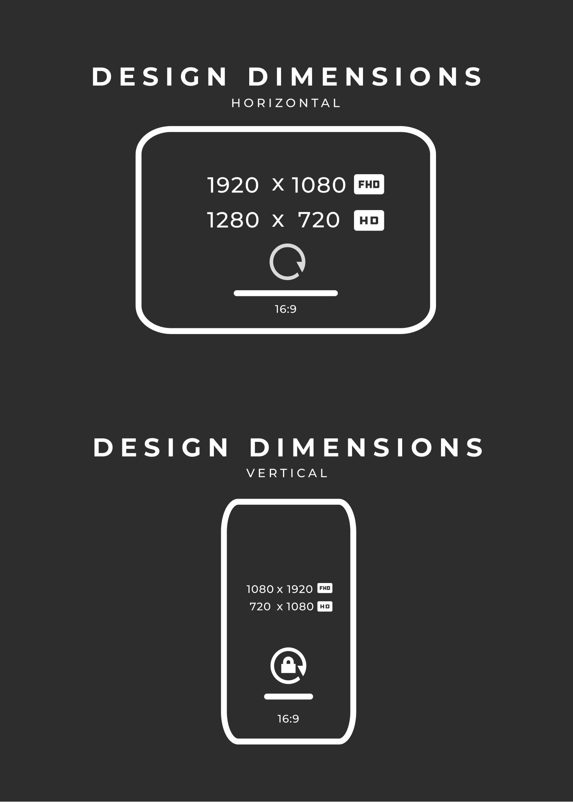

# 📚 Libridigm v2.0

**Libridigm v2.0** is a versatile Library Management System developed in C# for the Windows platform. Future iterations will extend its functionality to include Web, Android, and iOS platforms. This system simplifies the management of library collections, allowing seamless borrowing and lending of books.

---

## 📑 Table of Contents

- [🚀 Features](#-features)
  - [🔐 Login Page](#-login-page)
  - [📊 Dashboard](#-dashboard)
  - [🔔 Notifications Page](#-notifications-page)
  - [🆘 Help Page](#-help-page)
- [🎨 Design and Assets](#-design-and-assets)
  - [🖥️ Taskbar Icons](#-taskbar-icons)
  - [🗂️ Icon Pack](#-icon-pack)
  - [🎨 Color Palette](#-color-palette)
  - [📏 Design Dimensions](#-design-dimensions)
- [🛠️ Technology Stack](#-technology-stack)
- [🌍 Future Development](#-future-development)
- [📷 Screenshots](#-screenshots)
- [📞 Contact and Support](#-contact-and-support)

---

## 🚀 Features

### 🔐 Login Page

- **Remember Me**: Enables the system to remember your login credentials for future sessions. If disabled, your information will be securely erased after logout.
- **Secure Access**: Log in with your provided credentials. Contact your system administrator for access details.

### 📊 Dashboard

The **Dashboard** serves as the central hub for accessing various features:
- **Notifications**: Stay up-to-date with important alerts.
- **Profile Management**: Modify personal details and settings.
- **Books Management**: Manage your library’s book collection.
- **History**: Review your borrowing history.
- **Reading Statistics**: Visualize your reading progress through metrics like:
  - Number of books read
  - Reading goals
  - Completed books
  - Total pages read
  - Interactive graphs

### 🔔 Notifications Page

The **Notifications Page** keeps you informed with:
- **Due Date Reminders**: Alerts for returning borrowed books.
- **System Notifications**: Stay updated with system-wide messages.

### 🆘 Help Page

The **Help Page** offers support features including:
- **Forgot Password**: Recover your account details easily.
- **Verification Code**: Request verification to secure your account.
- **Contact Support**: Send messages directly to the development team for assistance.

---

## 🎨 Design and Assets

Libridigm v2.0 offers a visually cohesive design, complete with assets for both light and dark themes.

### 🖥️ Taskbar Icons
- **96 x 96 pixels**: Optimized for clarity in both light and dark themes.

### 🗂️ Icon Pack
- **Comprehensive Icon Set**: Includes all icons used across the project, available in both themes.

### 🎨 Color Palette
- **Project Color Scheme**: A unified color palette that defines the project’s aesthetic.

### 📏 Design Dimensions
- **Layout Guidelines**: Detailed dimensions to ensure consistency across different screens.

---

## 🛠️ Technology Stack
- **Programming Language**: 
- **Platform**: 
- **Database**: Local MySQL (future versions will include expanded support)

---

## 🌍 Future Development

Libridigm v2.0 is designed to evolve. Planned future updates include:
- **Web Application**: A responsive interface for browser access.
- **Mobile Applications**: Native support for Android and iOS platforms.

- [ ] ADMIN panel (Book registration, book deletion, inventory management, controlling members, defining books for members)
- [ ] User panel (Borrow a book, Buy a book, Request a book)
- [ ] Book Screens (Summary for the book, Questions about the book)

---

## 📷 Screenshots

Here’s a glimpse of what Libridigm v2.0 looks like:

  
HomePage

  

  
Dashboard

  

  
Notifications

  

  
Help Page

  

---

## 📞 Contact and Support

For further assistance, please reach out to our development team at [Mail](mailto:tr.ahmetakifcetin@gmail.com).
